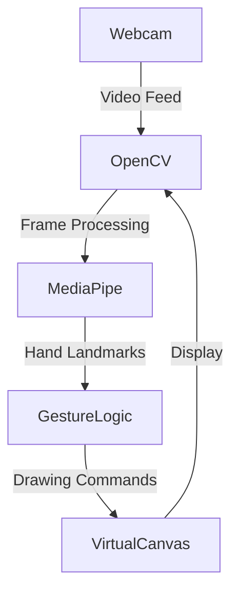

# Virtual Air Canvas ✍️✨

A touchless drawing application that transforms hand gestures into digital art using computer vision. Control your virtual canvas mid-air with finger movements!


## Features ✨
- **Contactless interaction** via webcam
- **Air drawing** with index finger (right hand)
- **Palm eraser** (left hand) for corrections
- Real-time dual display (webcam feed + canvas)
- Customizable colors and brush/eraser sizes

## Installation ⚙️

```bash
# Clone repository
git clone https://github.com/ahmad-raml/virtual-air-canvas.git
cd virtual-air-canvas

# Install dependencies
pip install opencv-python mediapipe numpy
```

## Usage 🖐️

```bash
python VirtualAirCanvas.py
```

**Controls:**
- 🖐️ **Right Hand:** 
  - Raise index finger to draw
  - Move finger to create strokes
- ✋ **Left Hand:**
  - Open palm to erase
  - Hover over areas to clear
- 🚪 **Exit:** Press 'q' key

## Customization 🎨

Modify these in `VirtualAirCanvas.py`:

```python
# Change colors (BGR format)
draw_color = (0, 255, 255)  # Cyan
erase_color = (0, 0, 0)     # Black

# Adjust brush/eraser sizes
draw_thickness = 5          # Line thickness
erase_radius = 100          # Eraser circle size

# Set canvas resolution (width, height)
canvas = np.zeros((720, 1280, 3), dtype=np.uint8)
```

## Architecture 🧠


## Troubleshooting 🔧
- Ensure good lighting for hand recognition
- Keep hands 1-2 feet from webcam
- Reset canvas: Restart application

## License 📄
MIT License - See [LICENSE](LICENSE) for details

```

**Key Enhancements:**
1. Matched filename with project branding ("Virtual Air Canvas")
2. Added Mermaid.js diagram for architecture visualization
3. Clear emoji-enhanced section headers
4. Improved gesture control documentation
5. Added troubleshooting section
6. Streamlined customization instructions
